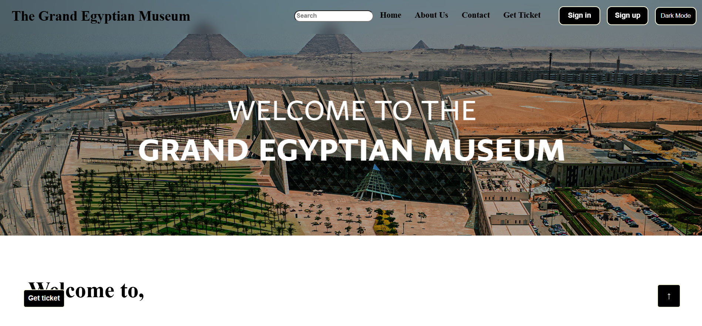
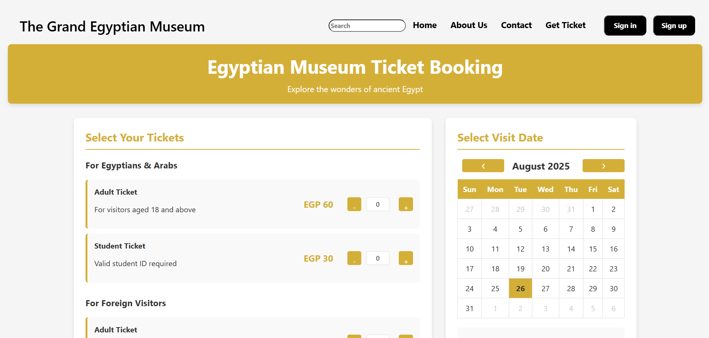
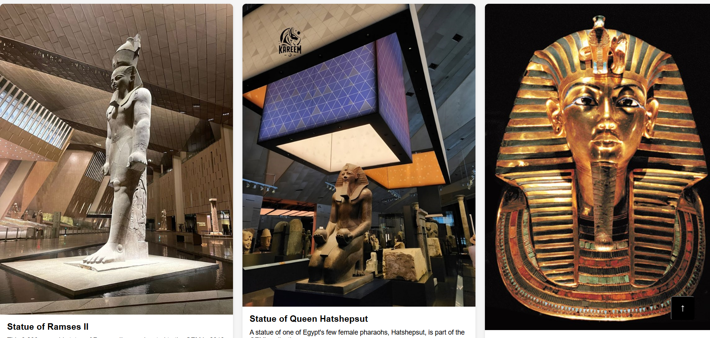
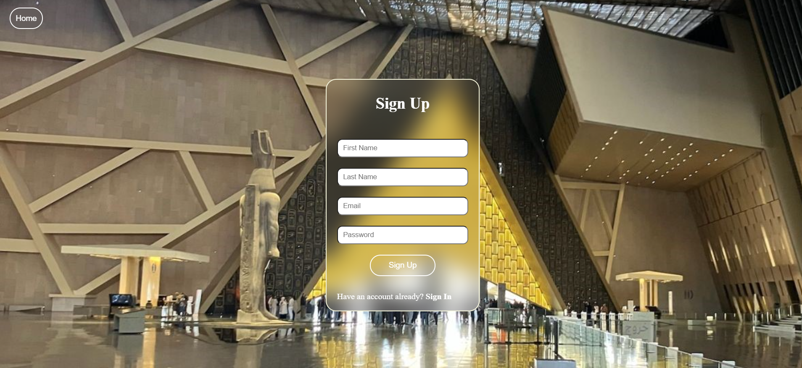

# 🏛️ Grand Egyptian Museum Website

A responsive and interactive website showcasing the Grand Egyptian Museum, built using HTML, CSS, and JavaScript.

---

## 🌟 Features
- Fully responsive design for all devices
- Modern and clean UI
- Interactive sections using JavaScript
- Smooth scrolling and navigation

---

## 🛠️ Tech Stack
- HTML5
- CSS3
- JavaScript (Vanilla JS)

---

## 📸 Preview




---

## 🎯 Purpose
This project was built to practice frontend development skills and create a visually appealing informational website about one of Egypt’s most iconic landmarks.

---

## 🚀 Live Demo
(ضع هنا رابط لو عامل deploy على Vercel أو Netlify)

---

## 📂 How to Run
1. Clone the repository:
```bash
git clone https://github.com/your-username/grand-egyptian-museum-website.git
